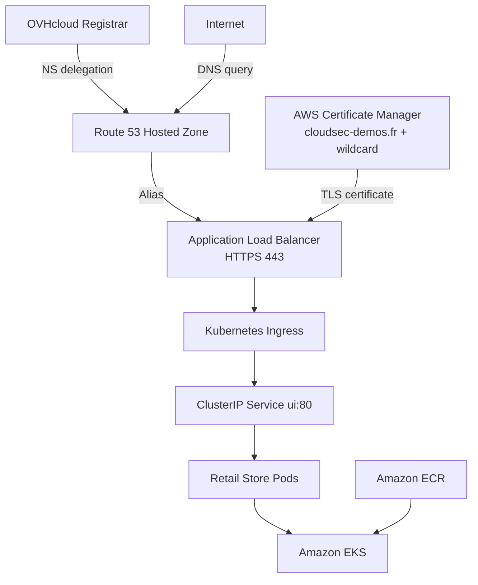
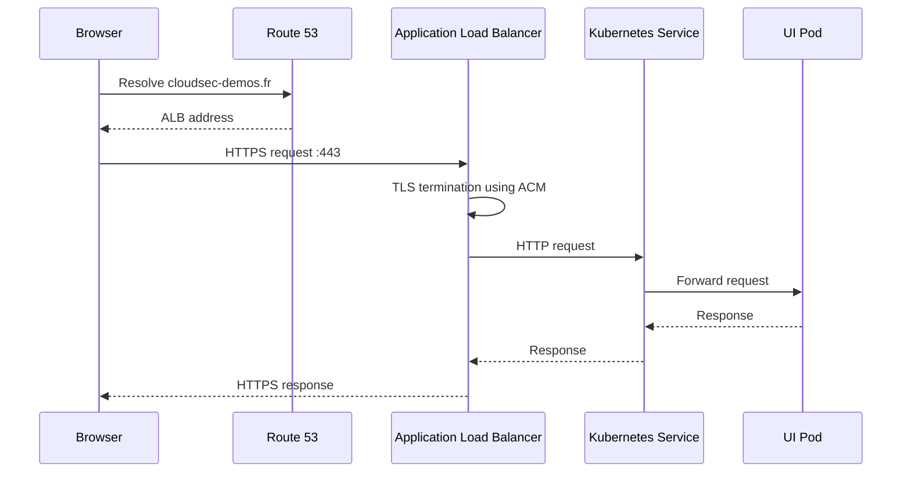
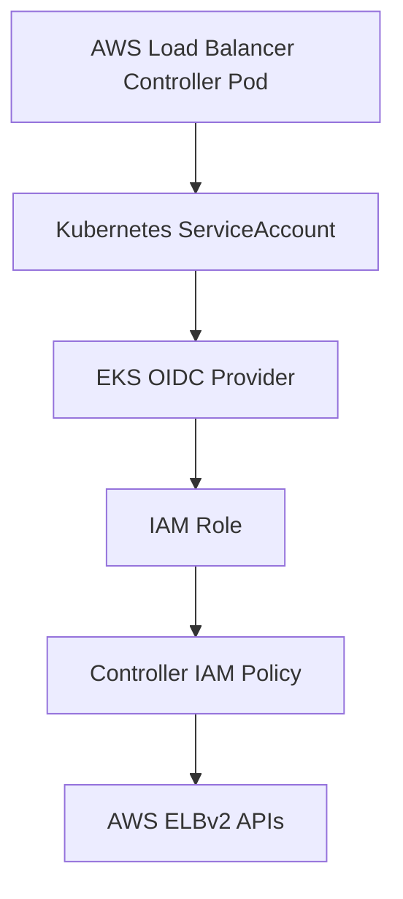
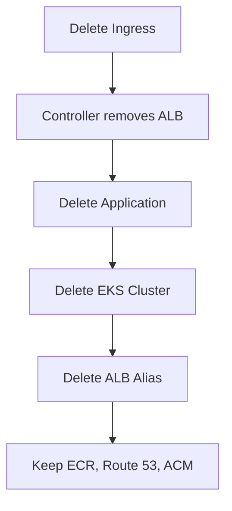

# Simple Cloud Security Demo

A reproducible AWS cloud-native security lab built around Amazon EKS and the AWS Retail Store Sample Application.

The project demonstrates how to build and expose a realistic Kubernetes-based microservices workload using Amazon EKS, Amazon ECR, Route 53, AWS Certificate Manager (ACM), and the AWS Load Balancer Controller.

The environment is intentionally designed as a short-lived security lab that can be created, validated, and destroyed while preserving the reusable components that take the longest to recreate.

## What this project demonstrates

- Amazon EKS cluster deployment
- Private Amazon ECR image mirroring
- Multi-architecture container image handling (`amd64` vs `arm64`)
- Kubernetes application deployment
- Route 53 authoritative DNS
- DNS delegation from OVHcloud
- ACM public wildcard TLS certificates
- AWS Load Balancer Controller
- IAM Roles for Service Accounts (IRSA)
- Application Load Balancer (ALB)
- Kubernetes Ingress
- Route 53 Alias records
- Reproducible teardown and cost management

## Architecture



## Request flow



## Design decisions

### Why Amazon EKS?

The application consists of multiple microservices and is intended to demonstrate Kubernetes networking, ingress, workload identity, and cloud-native security controls. EKS provides a managed Kubernetes control plane while preserving direct access to Kubernetes resources.

### Why private Amazon ECR?

The original application images are stored in public registries. Mirroring them into a private ECR registry provides a controlled image source and allows the environment to be recreated independently of the original public registry.

### Why ALB instead of a `LoadBalancer` Service?

The final architecture exposes the application through a Kubernetes Ingress managed by the AWS Load Balancer Controller. This provides Layer-7 routing, TLS termination, HTTP-to-HTTPS redirects, and host-based routing.

The backend `ui` service is intended to remain a `ClusterIP` service and is exposed exclusively through the ALB.

### Why `target-type: ip`?

Using IP target mode allows the ALB to register Kubernetes Pod IP addresses directly rather than routing traffic through worker-node `NodePort` services.

### Why ACM?

ACM provides a managed public certificate that integrates directly with the ALB. The certificate is validated through DNS and automatically renewed as long as the validation CNAME remains present.

### Why Route 53 Alias?

The apex domain `cloudsec-demos.fr` cannot use an ordinary CNAME because the zone apex must also contain NS and SOA records. Route 53 Alias records provide an AWS-native way to point the apex domain directly to an ALB.

## Security notice

This environment intentionally deploys a vulnerable demonstration application for security testing and learning.

It must not contain production data, credentials, or customer information.

The environment should be treated as short-lived, access should be restricted where practical, and the infrastructure should be destroyed after use to minimize both security exposure and AWS cost.

## Prerequisites

- AWS account
- AWS CLI v2
- `eksctl`
- `kubectl`
- Helm
- `skopeo`
- `dig`

## 1. Authenticate to AWS

The preferred authentication method is AWS IAM Identity Center (SSO) or another source of temporary AWS credentials.

```bash
aws configure sso
aws sso login --profile cloudsec-demo
export AWS_PROFILE=cloudsec-demo

aws sts get-caller-identity
```

For a personal lab, long-lived IAM access keys may also be used, but they should not be the preferred authentication method.

## 2. Define project variables

```bash
export AWS_REGION="us-east-1"
export EKS_VERSION="1.36"
export CLUSTER_NAME="deb-test100"
export DOMAIN="cloudsec-demos.fr"

export AWS_ACCOUNT_ID=$(aws sts get-caller-identity \
  --query Account \
  --output text)

export REGISTRY="${AWS_ACCOUNT_ID}.dkr.ecr.${AWS_REGION}.amazonaws.com"
export REPO="simple-cloudsec-demo"
```

Using the account ID dynamically makes the project reproducible in another AWS account.

## 3. Create the EKS cluster

```bash
eksctl create cluster \
  --name "$CLUSTER_NAME" \
  --region "$AWS_REGION" \
  --version "$EKS_VERSION" \
  --nodes 3
```

Verify the cluster:

```bash
kubectl get nodes
kubectl get pods -A
```

## 4. Mirror application images into Amazon ECR

The local development machine is ARM64 while the EKS worker nodes are AMD64.

The image copy process therefore explicitly selects the Linux AMD64 variant.

```bash
aws ecr get-login-password --region "$AWS_REGION" |
  skopeo login --username AWS --password-stdin "$REGISTRY"
```

Example copy command:

```bash
skopeo \
  --override-os linux \
  --override-arch amd64 \
  copy \
  docker://SOURCE_IMAGE \
  docker://DESTINATION_IMAGE
```

The mirroring script creates missing ECR repositories, copies the AMD64 image variants, and rewrites `kubernetes.yaml` to reference the private ECR registry.

## 5. Deploy the Kubernetes application

```bash
kubectl apply -f kubernetes.yaml
```

Verify the workload:

```bash
kubectl get pods
kubectl get svc
```

All application Pods should eventually reach the `Running` state.

The application is exposed through the ALB Ingress rather than through a public `LoadBalancer` service.

## 6. Delegate DNS to Route 53

The domain remains registered with OVHcloud.

Only authoritative DNS hosting is delegated to Route 53.

Create the public hosted zone:

```bash
aws route53 create-hosted-zone \
  --name "$DOMAIN" \
  --caller-reference "$(date +%s)"
```

Retrieve the AWS name servers:

```bash
ZONE_ID=$(aws route53 list-hosted-zones-by-name \
  --dns-name "$DOMAIN" \
  --query "HostedZones[?Name=='$DOMAIN.'].Id | [0]" \
  --output text)

aws route53 get-hosted-zone \
  --id "$ZONE_ID" \
  --query 'DelegationSet.NameServers' \
  --output table
```

Replace the domain's authoritative name servers at OVHcloud with the Route 53 name servers.

Verify delegation:

```bash
dig NS "$DOMAIN" +short
```

The result should show the AWS Route 53 name servers.

## 7. Create the ACM wildcard certificate

The certificate covers both:

- `cloudsec-demos.fr`
- `*.cloudsec-demos.fr`

The wildcard covers first-level subdomains such as `www.cloudsec-demos.fr`, `shop.cloudsec-demos.fr`, and `api.cloudsec-demos.fr`.

Request the certificate:

```bash
CERT_ARN=$(aws acm request-certificate \
  --domain-name "$DOMAIN" \
  --subject-alternative-names "*.$DOMAIN" \
  --validation-method DNS \
  --region "$AWS_REGION" \
  --query CertificateArn \
  --output text)

echo "$CERT_ARN"
```

Inspect the validation records:

```bash
aws acm describe-certificate \
  --certificate-arn "$CERT_ARN" \
  --region "$AWS_REGION" \
  --query 'Certificate.DomainValidationOptions[].{
    Domain:DomainName,
    Name:ResourceRecord.Name,
    Type:ResourceRecord.Type,
    Value:ResourceRecord.Value
  }' \
  --output table
```

Create the ACM validation CNAME in Route 53.

Verify it directly against the authoritative Route 53 server:

```bash
dig +short CNAME "$VALIDATION_NAME" @ns-430.awsdns-53.com
```

Wait for validation:

```bash
aws acm wait certificate-validated \
  --certificate-arn "$CERT_ARN" \
  --region "$AWS_REGION"
```

Verify the certificate:

```bash
aws acm describe-certificate \
  --certificate-arn "$CERT_ARN" \
  --region "$AWS_REGION" \
  --query 'Certificate.{Status:Status,Domain:DomainName,SANs:SubjectAlternativeNames}' \
  --output json
```

The certificate should report `ISSUED`.

Keep the ACM validation CNAME in Route 53 because ACM uses it for certificate renewal.

## 8. Install the AWS Load Balancer Controller

The controller watches Kubernetes Ingress resources and creates or reconciles the corresponding AWS ALB resources.

### Workload identity



The controller receives AWS permissions through IAM Roles for Service Accounts (IRSA) rather than inheriting the administrator's permissions.

Install the controller using the documented IAM policy, IRSA role, Kubernetes ServiceAccount, and Helm chart.

Verify:

```bash
kubectl get deployment \
  -n kube-system \
  aws-load-balancer-controller
```

The deployment should report ready replicas.

## 9. Create the Ingress

The Ingress declares the desired Layer-7 routing configuration and references the ACM certificate.

The AWS Load Balancer Controller observes the Ingress and creates or reconciles the ALB, listeners, target groups, and routing rules.

Example annotations:

```yaml
metadata:
  annotations:
    alb.ingress.kubernetes.io/scheme: internet-facing
    alb.ingress.kubernetes.io/target-type: ip
    alb.ingress.kubernetes.io/listen-ports: '[{"HTTP":80},{"HTTPS":443}]'
    alb.ingress.kubernetes.io/ssl-redirect: "443"
    alb.ingress.kubernetes.io/certificate-arn: <CERT_ARN>
```

Apply the Ingress:

```bash
kubectl apply -f ingress.yaml
```

Wait for the ALB hostname:

```bash
kubectl get ingress
```

## 10. Create the Route 53 Alias

Retrieve the ALB DNS name:

```bash
ALB_DNS=$(kubectl get ingress retail-store-ingress \
  -o jsonpath='{.status.loadBalancer.ingress[0].hostname}')
```

Retrieve the ALB hosted-zone ID:

```bash
ALB_ZONE_ID=$(aws elbv2 describe-load-balancers \
  --region "$AWS_REGION" \
  --query "LoadBalancers[?DNSName=='$ALB_DNS'].CanonicalHostedZoneId | [0]" \
  --output text)
```

Create the Route 53 Alias record for the apex domain.

The Alias points `cloudsec-demos.fr` directly to the dynamically managed ALB without hard-coding ALB IP addresses.

## 11. Validate the deployment

Check DNS:

```bash
dig +short A "$DOMAIN"
```

Check HTTPS:

```bash
curl -Iv "https://$DOMAIN"
```

Expected behavior:

- DNS resolves to the ALB.
- HTTP redirects to HTTPS.
- The ACM certificate is presented.
- The Kubernetes `ui` service returns the application.

## Cost management

The primary AWS cost drivers while the lab is running are:

- EKS control plane
- EC2 worker nodes
- Application Load Balancer
- NAT Gateway, if used
- EBS volumes
- Public IPv4 addresses
- Route 53 hosted zone

The following components are retained between lab runs because they are reusable and relatively inexpensive to keep:

- Private ECR repositories and mirrored images
- Route 53 hosted zone
- DNS delegation at OVHcloud
- ACM certificate and validation CNAME
- Local project files and scripts

## Teardown

The teardown sequence removes resources in dependency order so that the AWS Load Balancer Controller can clean up the ALB before the cluster is destroyed.



### Delete the Ingress

```bash
kubectl delete -f ingress.yaml
```

Wait until the ALB has disappeared.

### Delete the application

```bash
kubectl delete -f kubernetes.yaml
```

### Delete the EKS cluster

```bash
eksctl delete cluster \
  --name "$CLUSTER_NAME" \
  --region "$AWS_REGION"
```

### Remove the Route 53 Alias

Delete the apex Alias record that points to the ALB because every newly created ALB receives a new DNS name.

The following resources are intentionally retained for the next deployment:

- ECR repositories and mirrored images
- Route 53 hosted zone
- OVHcloud DNS delegation
- ACM wildcard certificate
- ACM validation CNAME
- Local project files and scripts

This allows the environment to be recreated quickly while minimizing unnecessary AWS cost.
