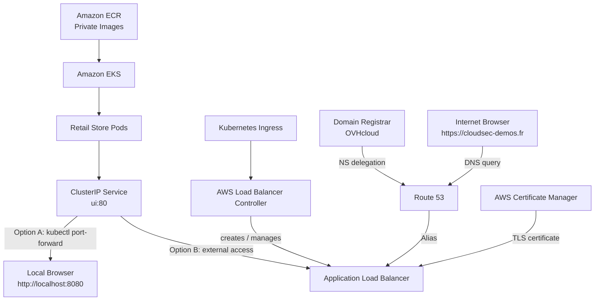
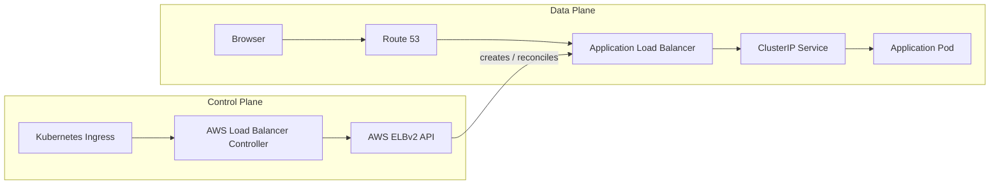
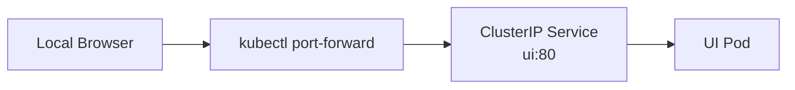
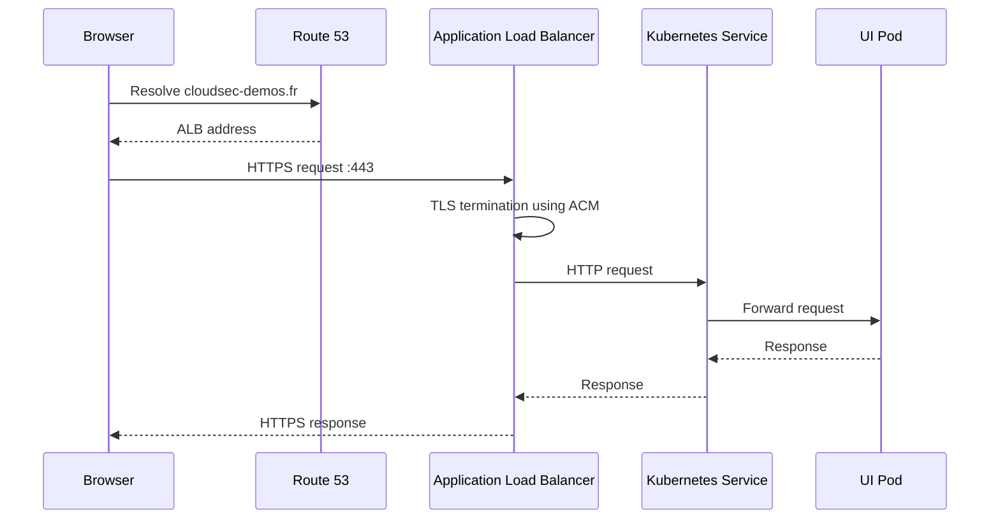
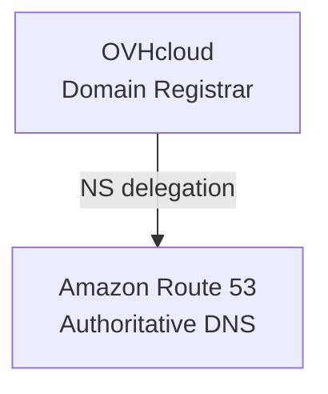
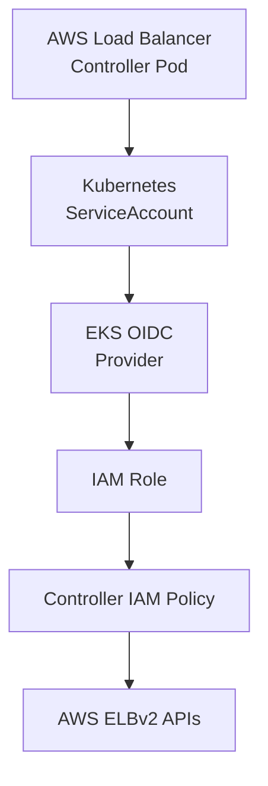
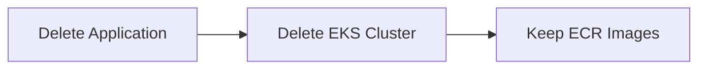
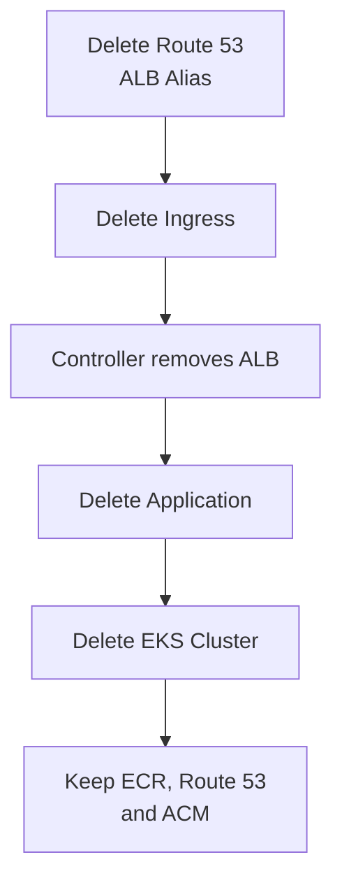

# Simple Cloud Security Demo

A reproducible AWS cloud-native security lab built around Amazon EKS and the AWS Retail Store Sample Application.

The project demonstrates how to deploy a realistic Kubernetes-based microservices workload using Amazon EKS and Amazon ECR, and then optionally expose it through a production-like AWS ingress architecture using an Application Load Balancer, Route 53, and AWS Certificate Manager.

The environment is intentionally designed as a short-lived security lab that can be created, validated, and destroyed while preserving reusable components that take longer to recreate.

## What this project demonstrates

- Amazon EKS cluster deployment
- Private Amazon ECR image mirroring
- Multi-architecture container image handling (`amd64` vs `arm64`)
- Kubernetes application deployment
- Kubernetes `ClusterIP` Services
- Local application access with `kubectl port-forward`
- AWS Load Balancer Controller
- IAM Roles for Service Accounts (IRSA)
- Kubernetes Ingress
- Application Load Balancer (ALB)
- Route 53 authoritative DNS
- DNS delegation from OVHcloud
- ACM public wildcard TLS certificates
- Route 53 Alias records
- Reproducible teardown and cost management

---

# Architecture

The Kubernetes application itself does not require a registered domain, Route 53, ACM, or an Application Load Balancer.

The project therefore supports two access models:

1. **Minimal lab deployment** — access the application locally through `kubectl port-forward`.
2. **Production-like external access** — expose the application through an AWS ALB with Route 53 DNS and ACM-managed HTTPS.



## Control plane vs data plane

The Kubernetes Ingress is not itself in the application traffic path.

It is a declarative Kubernetes object that tells the AWS Load Balancer Controller what external routing infrastructure should exist.



This distinction is important:

- the **control plane** creates and manages infrastructure;
- the **data plane** carries application traffic.

---

# Access options

## Option A — Minimal deployment without a domain

A registered domain is not required to run or test the application.

The core architecture is simply:



Access the application locally with:

```bash
kubectl port-forward svc/ui 8080:80
```

Then open:

```text
http://localhost:8080
```

This path requires:

- Amazon EKS
- Amazon ECR
- Kubernetes workloads
- Kubernetes Services

It does **not** require:

- a registered domain
- Route 53
- ACM
- AWS Load Balancer Controller
- Application Load Balancer
- public DNS

This is the simplest and least expensive way to deploy the lab.

## Option B — Production-like external access

Readers who want to explore a more complete cloud architecture can continue with:

```text
Internet
   ↓
Route 53
   ↓
Application Load Balancer
   ↓
ClusterIP Service
   ↓
Pods
```

The external-access path additionally demonstrates:

- DNS delegation
- authoritative DNS
- TLS certificates
- workload identity
- Kubernetes Ingress
- ALB provisioning
- HTTP-to-HTTPS redirection
- Route 53 Alias records

A registered domain is required for the complete HTTPS architecture described in this README.

---

# Request flow with external access



---

# Design decisions

## Why Amazon EKS?

The application consists of multiple microservices and is intended to demonstrate Kubernetes networking, ingress, workload identity, and cloud-native security controls.

EKS provides a managed Kubernetes control plane while preserving direct access to Kubernetes resources.

## Why private Amazon ECR?

The original application images are stored in public registries.

Mirroring them into private ECR repositories provides a controlled image source and allows the environment to be recreated independently of the original public registry.

It also provides a cloud-native registry that can later be included in container vulnerability and software supply-chain security assessments.

## Why `ClusterIP` Services?

The Kubernetes Services are internal application abstractions.

They do not need to expose their own AWS load balancers.

Keeping the `ui` service as `ClusterIP` separates the application from the mechanism used to expose it externally.

This allows the same workload to support both:

```text
ClusterIP
    │
    ├── kubectl port-forward
    │
    └── Application Load Balancer
```

without modifying the application architecture.

## Why ALB instead of a `LoadBalancer` Service?

The production-like architecture exposes the application through Kubernetes Ingress managed by the AWS Load Balancer Controller.

This provides Layer-7 functionality such as:

- TLS termination
- HTTP-to-HTTPS redirects
- host-based routing
- path-based routing
- centralized external ingress

A `LoadBalancer` Service is therefore unnecessary for the `ui` service.

## Why `target-type: ip`?

Using IP target mode allows the ALB to register Kubernetes Pod IP addresses directly.

The traffic path becomes:

```text
ALB
 ↓
Pod IP
```

rather than:

```text
ALB
 ↓
Worker Node
 ↓
NodePort
 ↓
Pod
```

## Why ACM?

AWS Certificate Manager provides managed public certificates that integrate directly with Application Load Balancers.

The certificate is validated through DNS and automatically renewed while its validation record remains present.

## Why Route 53 Alias?

The apex domain `cloudsec-demos.fr` cannot use an ordinary CNAME because the zone apex must also contain DNS records such as NS and SOA.

Route 53 Alias records provide an AWS-native mechanism for pointing the apex domain directly to an ALB.

---

# Security notice

This environment intentionally deploys a vulnerable demonstration application for security testing and learning.

It must not contain:

- production data
- customer information
- production credentials
- sensitive secrets

The environment should be treated as short-lived.

Internet access should be restricted where practical, and public infrastructure should be destroyed after the demonstration to minimize both security exposure and AWS cost.

For readers who do not require Internet exposure, **Option A using `kubectl port-forward` is the safer default**.

---

# Prerequisites

Required for both deployment options:

- AWS account
- AWS CLI v2
- `eksctl`
- `kubectl`
- `skopeo`

Required only for the external-access path:

- Helm
- `dig`
- registered domain name
- access to the domain registrar's nameserver configuration

---

# 1. Authenticate to AWS

This project can use standard AWS CLI credentials for a standalone personal lab.

Configure the AWS CLI:

```bash
aws configure
```

Provide the access key, secret access key, default region, and preferred output format:

```text
AWS Access Key ID: <access-key>
AWS Secret Access Key: <secret-key>
Default region name: us-east-1
Default output format: json
```

Verify the active AWS identity before creating any resources:

```bash
aws sts get-caller-identity
```

> **Security note:** Never use root-user access keys, store AWS credentials in the repository, or embed credentials directly in scripts. Access keys used for a lab should belong to a dedicated IAM identity, be granted only the permissions required by the project, and be rotated or removed when no longer required.
>
> In an enterprise or multi-account AWS environment, temporary credentials through AWS IAM Identity Center (SSO) or another federated identity provider would generally be preferred over long-lived IAM user credentials.

# 2. Define project variables

```bash
export AWS_REGION="us-east-1"
export EKS_VERSION="1.36"
export CLUSTER_NAME="deb-test100"

export AWS_ACCOUNT_ID=$(aws sts get-caller-identity \
  --query Account \
  --output text)

export REGISTRY="${AWS_ACCOUNT_ID}.dkr.ecr.${AWS_REGION}.amazonaws.com"
export REPO="simple-cloudsec-demo"
```

Using the AWS account ID dynamically makes the project reusable in another AWS account.

The domain variable is required only when using the external-access deployment path:

```bash
export DOMAIN="cloudsec-demos.fr"
```

---

# 3. Create the EKS cluster

```bash
eksctl create cluster \
  --name "$CLUSTER_NAME" \
  --region "$AWS_REGION" \
  --version "$EKS_VERSION" \
  --nodegroup-name workers \
  --node-type t3.medium \
  --nodes 3 \
  --nodes-min 1 \
  --nodes-max 3 \
  --managed
```

Verify the cluster:

```bash
kubectl get nodes
kubectl get pods -A
```

---

# 4. Mirror application images into Amazon ECR

The reference Retail Store application uses images hosted in public registries.

This project mirrors the images into private ECR repositories.

The local development machine used to build this project is ARM64, while the EKS worker nodes are AMD64.

Without explicitly selecting the target architecture, multi-architecture container images can result in the ARM64 image variant being copied to ECR and subsequently failing on AMD64 worker nodes.

The copy process therefore explicitly selects:

```text
OS:           linux
Architecture: amd64
```

Authenticate `skopeo` to ECR:

```bash
aws ecr get-login-password \
  --region "$AWS_REGION" |
  skopeo login \
    --username AWS \
    --password-stdin "$REGISTRY"
```

Example image copy:

```bash
skopeo \
  --override-os linux \
  --override-arch amd64 \
  copy \
  docker://SOURCE_IMAGE \
  docker://DESTINATION_IMAGE
```

The project's `copy-images.sh` script:

1. parses image references from `kubernetes.yaml`;
2. creates missing ECR repositories;
3. copies the Linux AMD64 image variants;
4. updates `kubernetes.yaml` with the private ECR locations.

Verify a mirrored image architecture with:

```bash
skopeo \
  --override-os linux \
  --override-arch amd64 \
  inspect \
  docker://IMAGE |
grep -E '"Architecture"|"Os"'
```

Expected result:

```text
"Architecture": "amd64"
"Os": "linux"
```

---

# 5. Deploy the Kubernetes application

Apply the Kubernetes manifest:

```bash
kubectl apply -f kubernetes.yaml
```

Wait for the Deployments:

```bash
kubectl wait \
  --for=condition=available \
  deployments \
  --all \
  --timeout=10m
```

Verify the workloads:

```bash
kubectl get pods
kubectl get svc
```

All application Pods should eventually reach the `Running` state.

The `ui` service should remain internal to the cluster:

```text
TYPE
ClusterIP
```

---

# 6. Validate the application without a domain

At this point, the application itself is fully deployed.

No DNS, TLS certificate, Ingress, or Application Load Balancer is required to test it.

Forward a local port to the Kubernetes `ui` service:

```bash
kubectl port-forward svc/ui 8080:80
```

Open:

```text
http://localhost:8080
```

Or test with:

```bash
curl -I http://localhost:8080
```

If local-only access is sufficient, the deployment can stop here.

The following sections are optional and build a production-like external access architecture.

---

# Optional external access architecture

The remaining sections add:

```text
Registered Domain
       ↓
Route 53
       ↓
ACM Certificate
       ↓
AWS Load Balancer Controller
       ↓
Application Load Balancer
       ↓
ClusterIP Service
       ↓
Pods
```

---

# 7. Delegate DNS to Route 53

The domain remains registered with OVHcloud.

Only authoritative DNS hosting is delegated to AWS Route 53.



Create a Route 53 public hosted zone:

```bash
aws route53 create-hosted-zone \
  --name "$DOMAIN" \
  --caller-reference "$(date +%s)"
```

Retrieve its zone ID:

```bash
ZONE_ID=$(aws route53 list-hosted-zones-by-name \
  --dns-name "$DOMAIN" \
  --query "HostedZones[?Name=='$DOMAIN.'].Id | [0]" \
  --output text)

echo "$ZONE_ID"
```

Retrieve the Route 53 authoritative nameservers:

```bash
aws route53 get-hosted-zone \
  --id "$ZONE_ID" \
  --query 'DelegationSet.NameServers' \
  --output table
```

Replace the authoritative nameservers configured at OVHcloud with the four Route 53 nameservers.

The domain registration itself remains at OVHcloud.

Verify delegation:

```bash
dig NS "$DOMAIN" +short
```

The result should show the Route 53 nameservers.

---

# 8. Create the ACM wildcard certificate

Request a public ACM certificate covering both:

```text
cloudsec-demos.fr
*.cloudsec-demos.fr
```

The wildcard covers first-level subdomains such as:

```text
www.cloudsec-demos.fr
shop.cloudsec-demos.fr
api.cloudsec-demos.fr
```

The wildcard does not cover the zone apex itself, which is why both names are included.

Request the certificate:

```bash
CERT_ARN=$(aws acm request-certificate \
  --domain-name "$DOMAIN" \
  --subject-alternative-names "*.$DOMAIN" \
  --validation-method DNS \
  --region "$AWS_REGION" \
  --query CertificateArn \
  --output text)

echo "$CERT_ARN"
```

Inspect the DNS validation records:

```bash
aws acm describe-certificate \
  --certificate-arn "$CERT_ARN" \
  --region "$AWS_REGION" \
  --query 'Certificate.DomainValidationOptions[].{
    Domain:DomainName,
    Name:ResourceRecord.Name,
    Type:ResourceRecord.Type,
    Value:ResourceRecord.Value
  }' \
  --output table
```

Extract the validation record:

```bash
VALIDATION_NAME=$(aws acm describe-certificate \
  --certificate-arn "$CERT_ARN" \
  --region "$AWS_REGION" \
  --query 'Certificate.DomainValidationOptions[0].ResourceRecord.Name' \
  --output text)

VALIDATION_VALUE=$(aws acm describe-certificate \
  --certificate-arn "$CERT_ARN" \
  --region "$AWS_REGION" \
  --query 'Certificate.DomainValidationOptions[0].ResourceRecord.Value' \
  --output text)
```

Create the CNAME:

```bash
aws route53 change-resource-record-sets \
  --hosted-zone-id "$ZONE_ID" \
  --change-batch "{
    \"Changes\": [{
      \"Action\": \"UPSERT\",
      \"ResourceRecordSet\": {
        \"Name\": \"$VALIDATION_NAME\",
        \"Type\": \"CNAME\",
        \"TTL\": 300,
        \"ResourceRecords\": [{
          \"Value\": \"$VALIDATION_VALUE\"
        }]
      }
    }]
  }"
```

Verify the record against an authoritative Route 53 nameserver:

```bash
dig +short CNAME \
  "$VALIDATION_NAME" \
  @ns-430.awsdns-53.com
```

Wait for validation:

```bash
aws acm wait certificate-validated \
  --certificate-arn "$CERT_ARN" \
  --region "$AWS_REGION"
```

Verify:

```bash
aws acm describe-certificate \
  --certificate-arn "$CERT_ARN" \
  --region "$AWS_REGION" \
  --query 'Certificate.{
    Status:Status,
    Domain:DomainName,
    SANs:SubjectAlternativeNames
  }' \
  --output json
```

Expected state:

```json
{
  "Status": "ISSUED",
  "Domain": "cloudsec-demos.fr",
  "SANs": ["cloudsec-demos.fr", "*.cloudsec-demos.fr"]
}
```

Keep the validation CNAME after issuance because ACM uses DNS validation for automatic certificate renewal.

---

# 9. Install the AWS Load Balancer Controller

The AWS Load Balancer Controller watches Kubernetes Ingress resources and reconciles them with AWS Elastic Load Balancing resources.

## Workload identity



The controller receives workload-specific AWS permissions rather than inheriting the credentials of the administrator who deployed the cluster.

Associate the EKS OIDC provider:

```bash
eksctl utils associate-iam-oidc-provider \
  --cluster "$CLUSTER_NAME" \
  --region "$AWS_REGION" \
  --approve
```

Download the controller IAM policy:

```bash
curl -O \
https://raw.githubusercontent.com/kubernetes-sigs/aws-load-balancer-controller/v2.14.1/docs/install/iam_policy.json
```

Create the IAM policy:

```bash
aws iam create-policy \
  --policy-name AWSLoadBalancerControllerIAMPolicy \
  --policy-document file://iam_policy.json
```

Create the ServiceAccount and IAM role:

```bash
eksctl create iamserviceaccount \
  --cluster "$CLUSTER_NAME" \
  --namespace kube-system \
  --name aws-load-balancer-controller \
  --attach-policy-arn \
    "arn:aws:iam::$AWS_ACCOUNT_ID:policy/AWSLoadBalancerControllerIAMPolicy" \
  --override-existing-serviceaccounts \
  --region "$AWS_REGION" \
  --approve
```

Install the controller:

```bash
helm repo add eks \
  https://aws.github.io/eks-charts

helm repo update eks

helm install aws-load-balancer-controller \
  eks/aws-load-balancer-controller \
  -n kube-system \
  --set clusterName="$CLUSTER_NAME" \
  --set serviceAccount.create=false \
  --set serviceAccount.name=aws-load-balancer-controller \
  --version 1.14.0
```

Verify:

```bash
kubectl get deployment \
  -n kube-system \
  aws-load-balancer-controller
```

---

# 10. Create the Kubernetes Ingress

The Ingress is the desired Layer-7 routing configuration.

The AWS Load Balancer Controller observes this object and creates or reconciles:

- the Application Load Balancer;
- listeners;
- target groups;
- routing rules.

The Ingress does not reference an existing ALB.

Instead, the controller creates and manages the ALB based on the Kubernetes configuration.

Example:

```yaml
apiVersion: networking.k8s.io/v1
kind: Ingress

metadata:
  name: retail-store-ingress
  annotations:
    alb.ingress.kubernetes.io/scheme: internet-facing
    alb.ingress.kubernetes.io/target-type: ip
    alb.ingress.kubernetes.io/listen-ports: '[{"HTTP":80},{"HTTPS":443}]'
    alb.ingress.kubernetes.io/ssl-redirect: "443"
    alb.ingress.kubernetes.io/certificate-arn: <CERT_ARN>

spec:
  ingressClassName: alb

  rules:
    - host: cloudsec-demos.fr
      http:
        paths:
          - path: /
            pathType: Prefix
            backend:
              service:
                name: ui
                port:
                  number: 80
```

Apply it:

```bash
kubectl apply -f ingress.yaml
```

Watch reconciliation:

```bash
kubectl get ingress \
  retail-store-ingress \
  --watch
```

Once provisioning completes, the Ingress should contain an AWS ALB hostname.

---

# 11. Create the Route 53 Alias

Retrieve the ALB DNS name:

```bash
ALB_DNS=$(kubectl get ingress \
  retail-store-ingress \
  -o jsonpath='{.status.loadBalancer.ingress[0].hostname}')

echo "$ALB_DNS"
```

Retrieve the ALB's AWS hosted-zone ID:

```bash
ALB_ZONE_ID=$(aws elbv2 describe-load-balancers \
  --region "$AWS_REGION" \
  --query \
    "LoadBalancers[?DNSName=='$ALB_DNS'].CanonicalHostedZoneId | [0]" \
  --output text)

echo "$ALB_ZONE_ID"
```

Create the apex Route 53 Alias:

```bash
aws route53 change-resource-record-sets \
  --hosted-zone-id "$ZONE_ID" \
  --change-batch "{
    \"Changes\": [{
      \"Action\": \"UPSERT\",
      \"ResourceRecordSet\": {
        \"Name\": \"$DOMAIN\",
        \"Type\": \"A\",
        \"AliasTarget\": {
          \"HostedZoneId\": \"$ALB_ZONE_ID\",
          \"DNSName\": \"$ALB_DNS\",
          \"EvaluateTargetHealth\": false
        }
      }
    }]
  }"
```

The Alias points the domain to the ALB without hard-coding the ALB's IP addresses.

---

# 12. Validate the external deployment

Check DNS:

```bash
dig +short A "$DOMAIN"
```

Inspect HTTPS:

```bash
curl -Iv "https://$DOMAIN"
```

Test HTTP redirection:

```bash
curl -I "http://$DOMAIN"
```

Expected behavior:

```text
DNS
 ↓
Route 53 Alias
 ↓
ALB
 ↓
HTTPS :443
 ↓
TLS termination using ACM
 ↓
Kubernetes Service
 ↓
Application Pod
```

The HTTP endpoint should redirect to HTTPS.

---

# Cost management

The minimal deployment path avoids several additional AWS resources.

## Option A — local access

Primary cost drivers:

- EKS control plane
- EC2 worker nodes
- EBS volumes

## Option B — external access

Additional cost drivers may include:

- Application Load Balancer
- public IPv4 addressing
- Route 53 hosted zone
- NAT Gateway, depending on the VPC architecture

Reusable components retained between lab runs include:

- private ECR repositories and images;
- Route 53 hosted zone;
- OVHcloud DNS delegation;
- ACM certificate;
- ACM validation CNAME;
- local project files and scripts.

---

# Teardown

The teardown procedure depends on which access model was deployed.

## Minimal deployment

If only local access through `kubectl port-forward` was used:



Delete the application:

```bash
kubectl delete -f kubernetes.yaml
```

Delete the cluster:

```bash
eksctl delete cluster \
  --name "$CLUSTER_NAME" \
  --region "$AWS_REGION"
```

---

## External-access deployment

When the ALB architecture is deployed, remove resources in dependency order:



## 1. Delete the Route 53 ALB Alias

Because a recreated ALB receives a different AWS DNS name, the Alias pointing to the current ALB should be removed.

The Route 53 hosted zone itself is retained.

## 2. Delete the Ingress

```bash
kubectl delete -f ingress.yaml
```

The AWS Load Balancer Controller should now remove the corresponding ALB resources.

Verify:

```bash
aws elbv2 describe-load-balancers \
  --region "$AWS_REGION" \
  --query 'LoadBalancers[].{
    Name:LoadBalancerName,
    DNS:DNSName
  }' \
  --output table
```

Do not delete the EKS cluster until the controller has finished removing the ALB.

## 3. Delete the Kubernetes application

```bash
kubectl delete -f kubernetes.yaml
```

## 4. Delete the EKS cluster

```bash
eksctl delete cluster \
  --name "$CLUSTER_NAME" \
  --region "$AWS_REGION"
```

## Resources intentionally retained

The following resources can be reused for the next deployment:

```text
ECR repositories + mirrored images
Route 53 hosted zone
OVHcloud → Route 53 NS delegation
ACM apex + wildcard certificate
ACM validation CNAME
local project files and scripts
```

This allows the environment to be recreated quickly while keeping the expensive runtime infrastructure short-lived.
